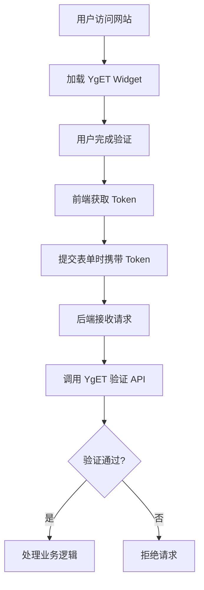

## 1. Product Overview
YgET 是一款现代化的验证码服务，提供安全、便捷的人机验证解决方案。仿造 trycap.dev 的设计风格，打造深色主题的技术文档网站。

- **核心目标**: 为开发者提供简单易用的验证码服务，支持多种验证方式（滑块、点选、拼图等）
- **目标用户**: Web 开发者、后端工程师、产品经理
- **市场价值**: 提供比传统验证码更安全、更友好的用户体验

## 2. Core Features

### 2.1 User Roles
| Role | Registration Method | Core Permissions |
|------|---------------------|------------------|
| 访客 | 无需注册 | 浏览文档、查看 Demo |
| 开发者 | Email 注册 | 查看完整文档、获取 API Key、使用测试环境 |

### 2.2 Feature Module
1. **首页**: Hero 区域、核心特性展示、快速开始引导
2. **文档页**: 左侧导航目录、右侧文档内容、代码示例
3. **Demo 演示页**: Widget 交互演示、实时验证效果
4. **API 文档页**: API 端点说明、请求响应示例

### 2.3 Page Details
| Page Name | Module Name | Feature description |
|-----------|-------------|---------------------|
| 首页 | Hero Section | 产品介绍、CTA 按钮、深色主题背景 |
| 首页 | Features | 核心特性卡片展示，悬停动画效果 |
| 首页 | Quickstart | 快速开始代码示例，一键复制 |
| 文档页 | Sidebar | 多级导航目录，当前页面高亮 |
| 文档页 | Content | Markdown 渲染内容，代码块高亮 |
| Demo 页 | Widget | 验证码组件交互演示 |
| API 页 | Endpoints | API 列表，请求/响应示例 |

## 3. Core Process

### 用户浏览流程
访客进入首页 → 查看产品介绍 → 点击快速开始 → 查看文档 → 集成 Widget → 在后端验证 Token

### 验证流程
客户端加载 Widget → 用户完成验证 → 获取 Token → 后端调用验证 API → 返回验证结果

## 4. User Interface Design

### 4.1 Design Style
- **主色调**: 深色背景 (#0a0a0f)，浅色文字 (#e4e4e7)，强调色使用青绿色 (#22d3ee) 和紫色 (#a855f7)
- **按钮风格**: 圆角 (8px)、渐变背景、悬停发光效果
- **字体**: 无衬线字体，标题使用大号粗体，正文使用中等字号
- **布局**: 三段式布局（顶部导航 + 左侧目录 + 右侧内容）
- **图标**: 使用 lucide-react，简洁线条风格

### 4.2 Page Design Overview
| Page Name | Module Name | UI Elements |
|-----------|-------------|-------------|
| 首页 | Hero | 大标题、副标题、CTA 按钮、背景渐变动画 |
| 首页 | Features | 卡片布局、图标、描述文字、悬停缩放效果 |
| 文档页 | Header | 固定顶部、Logo、搜索框、导航链接 |
| 文档页 | Sidebar | 固定左侧、多级列表、当前页高亮 |
| 文档页 | Content | 响应式布局、代码块、表格、引用块 |
| Demo 页 | Widget | 验证码组件、实时交互、成功/失败状态 |

### 4.3 Responsiveness
- **桌面端**: 三段式布局，最大宽度 1440px
- **平板端**: 侧边栏折叠为抽屉，内容区域自适应
- **移动端**: 顶部导航汉堡菜单，内容单列显示

### 4.4 3D Scene Guidance (Not applicable)
本项目为技术文档网站，无需 3D 场景。