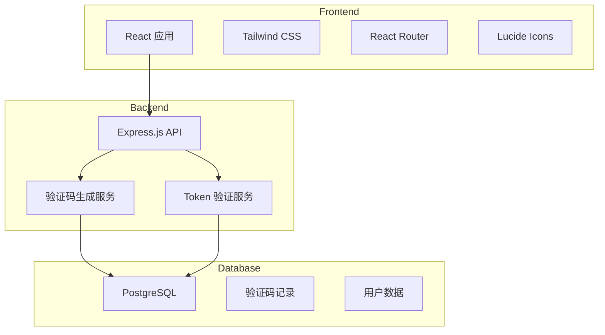
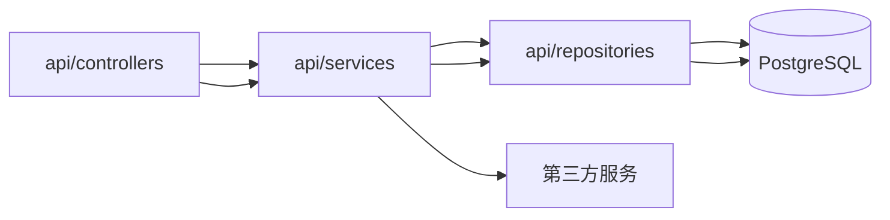

## 1. Architecture Design



## 2. Technology Description
- **Frontend**: React@18 + TypeScript + TailwindCSS@3 + Vite
- **Backend**: Express@4 + TypeScript
- **Database**: PostgreSQL
- **Initialization Tool**: vite-init
- **Icons**: lucide-react

## 3. Route Definitions

### Frontend Routes
| Route | Purpose |
|-------|---------|
| / | 首页，产品介绍和快速开始 |
| /guide | 文档引导页，Quickstart 内容 |
| /docs | 完整文档页面 |
| /demo | 验证码 Widget 演示 |
| /api | API 文档 |

### Backend API Routes
| Route | Method | Purpose |
|-------|--------|---------|
| /api/verify/token | POST | 验证 Token 有效性 |
| /api/captcha/generate | POST | 生成验证码 |
| /api/captcha/verify | POST | 验证用户输入 |

## 4. API Definitions

### 4.1 Token Verification
**POST /api/verify/token**

请求体:
```typescript
interface VerifyTokenRequest {
  token: string;
  secret: string;
}
```

响应:
```typescript
interface VerifyTokenResponse {
  success: boolean;
  message: string;
  data?: {
    challengeId: string;
    verifiedAt: Date;
  };
}
```

### 4.2 Generate Captcha
**POST /api/captcha/generate**

请求体:
```typescript
interface GenerateCaptchaRequest {
  type: 'slider' | 'click' | 'puzzle';
  siteKey: string;
}
```

响应:
```typescript
interface GenerateCaptchaResponse {
  success: boolean;
  challengeId: string;
  image: string;
  options?: {
    targetX: number;
    targetY: number;
  };
}
```

## 5. Server Architecture Diagram



## 6. Data Model

### 6.1 Data Model Definition

```mermaid
erDiagram
    USERS ||--o{ CAPTCHA_CHALLENGES : creates
    CAPTCHA_CHALLENGES ||--o{ VERIFICATION_TOKENS : generates
    
    USERS {
        id UUID PK
        email VARCHAR UNIQUE
        api_key VARCHAR
        created_at TIMESTAMP
        updated_at TIMESTAMP
    }
    
    CAPTCHA_CHALLENGES {
        id UUID PK
        user_id UUID FK
        type VARCHAR
        image_url VARCHAR
        target_position JSONB
        created_at TIMESTAMP
        expires_at TIMESTAMP
    }
    
    VERIFICATION_TOKENS {
        id UUID PK
        challenge_id UUID FK
        token VARCHAR UNIQUE
        is_valid BOOLEAN
        verified_at TIMESTAMP
        created_at TIMESTAMP
        expires_at TIMESTAMP
    }
```

### 6.2 Data Definition Language

```sql
CREATE TABLE users (
    id UUID PRIMARY KEY DEFAULT gen_random_uuid(),
    email VARCHAR(255) UNIQUE NOT NULL,
    api_key VARCHAR(64) UNIQUE NOT NULL,
    created_at TIMESTAMP DEFAULT NOW(),
    updated_at TIMESTAMP DEFAULT NOW()
);

CREATE TABLE captcha_challenges (
    id UUID PRIMARY KEY DEFAULT gen_random_uuid(),
    user_id UUID REFERENCES users(id),
    type VARCHAR(20) NOT NULL,
    image_url VARCHAR(512) NOT NULL,
    target_position JSONB,
    created_at TIMESTAMP DEFAULT NOW(),
    expires_at TIMESTAMP NOT NULL
);

CREATE TABLE verification_tokens (
    id UUID PRIMARY KEY DEFAULT gen_random_uuid(),
    challenge_id UUID REFERENCES captcha_challenges(id),
    token VARCHAR(255) UNIQUE NOT NULL,
    is_valid BOOLEAN DEFAULT true,
    verified_at TIMESTAMP,
    created_at TIMESTAMP DEFAULT NOW(),
    expires_at TIMESTAMP NOT NULL
);

CREATE INDEX idx_challenge_user_id ON captcha_challenges(user_id);
CREATE INDEX idx_token_challenge_id ON verification_tokens(challenge_id);
CREATE INDEX idx_token_expires ON verification_tokens(expires_at);
```